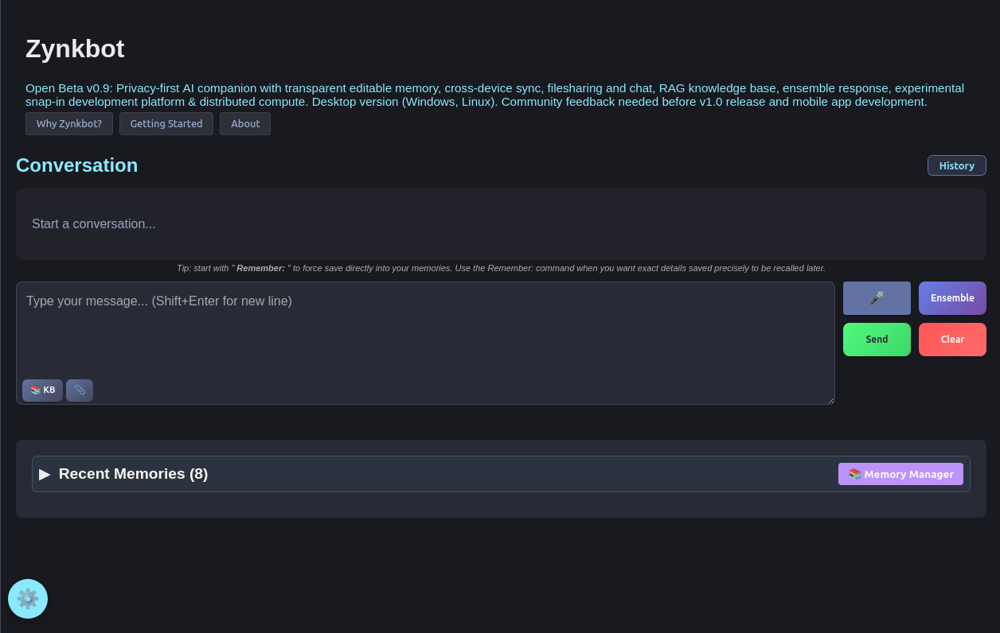
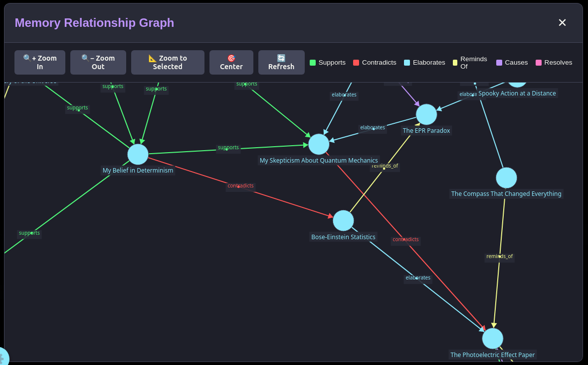
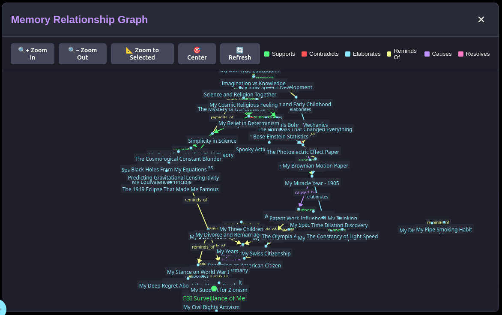
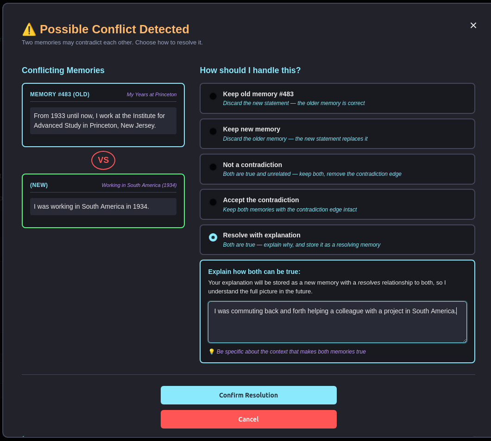
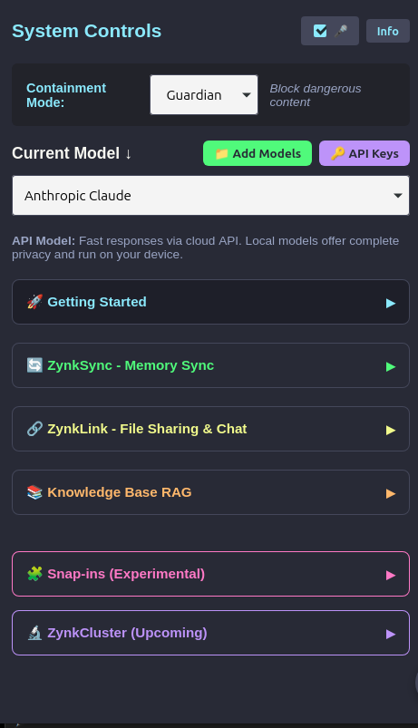
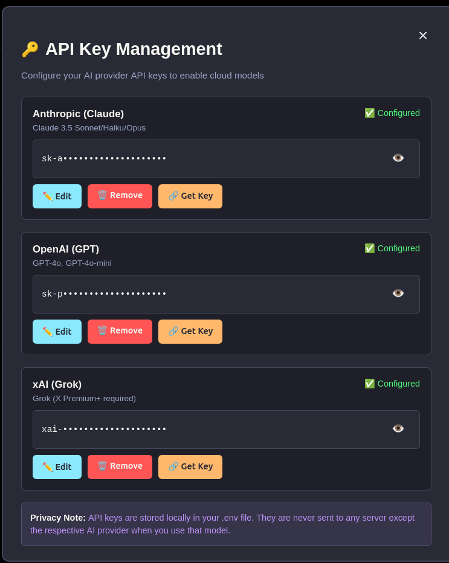
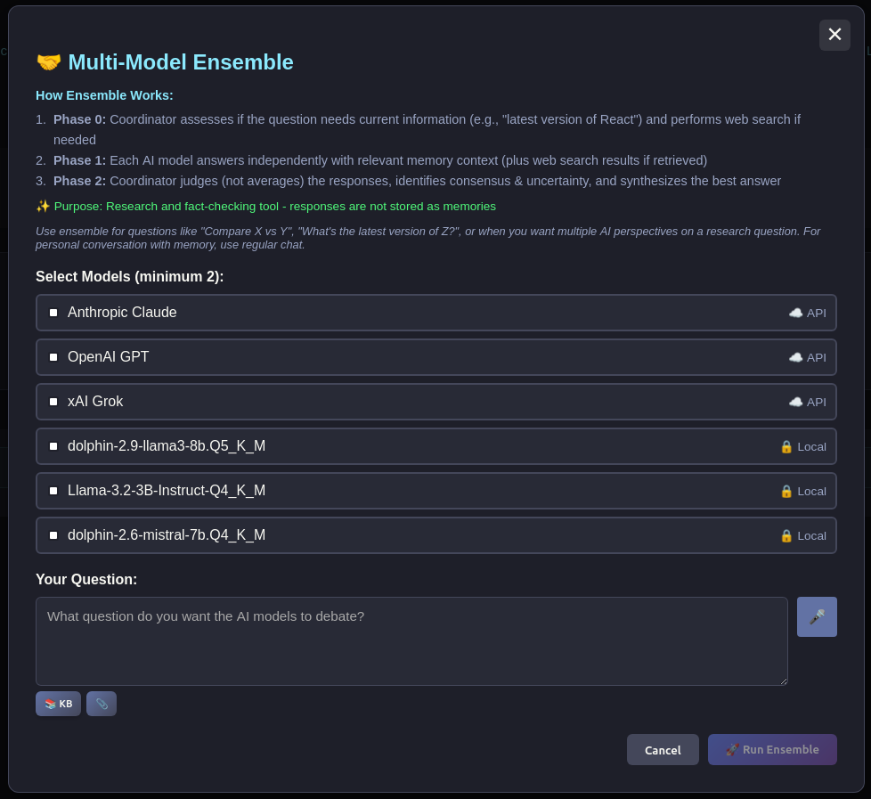

# Zynkbot

**A local-first AI that maps how your thinking evolves**

*By [ContainAI](https://containai.ai) – Building ethical AI infrastructure*

Most tools that remember things for you either store facts (notes, journals) or store conversations (AI assistants). Zynkbot does something different: it builds a structured, relational memory of not just *what* you've thought and decided, but *how* your understanding changed over time — which beliefs shifted, which ideas connected, where new information contradicted the old. It's closer in spirit to Obsidian or Roam than to a chatbot, but where those hold static notes, Zynkbot maintains a living memory graph that tracks the evolution of your own thinking.

There's no account to create. No email verification, no periodic login codes, no password resets — you install it and run it, the way software used to work. That's possible because there's no company in the middle: every memory Zynkbot builds lives in a database on your own device, and nothing leaves it unless you choose.

Zynkbot wasn't built to be anti-surveillance software by ideology. But when mainstream AI assistants store your conversations on corporate servers, train future models on what you tell them, and show you nothing of what they've kept — a record of your thinking, held by someone else, working for someone else — then keeping your own memory on your own machine stops being a niche privacy preference. It's become ordinary self-defense, for ordinary people.

The memory system is the core. Every conversation is processed into structured memories — facts, preferences, context, and the relationships between them — stored locally and retrieved semantically. Over time, that accumulated structure *is* your Zynkbot: the understanding you've built together. The underlying AI model is just the face — swap it for a different local model or switch cloud providers without losing anything. In this sense it's less like a chatbot and more like the computer aboard the Starship Enterprise: not because it talks to you, but because it never forgets what you've told it. It will come to know you well, and it's genuinely useful to talk to — but it isn't a replacement for the people in your life, and it isn't trying to be. It's a tool for understanding yourself, not a substitute for your relationships with other people.

Zynkbot also runs a networking layer entirely on your local network. ZynkSync keeps your memory database consistent across your own devices. ZynkLink enables direct file transfers between paired users. ZChat provides device-to-device messaging with no cloud relay. Download a colleague's project directly into your knowledge base and Zynkbot is instantly familiar with it — without any of it touching a third-party server.

And because the entire stack is offline-first — no cloud dependency, no subscription, no internet required — the same infrastructure that protects one person's memory also works where connectivity can't be assumed: field work, disaster response, resource-limited regions. A snap-in architecture customizes the platform for specific domains — healthcare, legal, research, enterprise — on the same local-first foundation. **[→ Digital resilience documentation](docs/DIGITAL_RESILIENCE.md)**

**[→ See how these features work in practice](docs/case_studies/)**



**Current Status**: Feature-complete v0.9 (Rust/Tauri desktop, Windows and Linux; open beta — see below). Mobile (Android, iOS) support planned via Tauri Mobile.

---

## Contents

- [Key Features](#key-features)
- [Installation](#installation)
- [Project Structure](#project-structure)
- [Architecture](#architecture)
- [Memory System](#memory-system)
- [Containment Modes](#containment-modes)
- [Networking Features](#networking-features)
- [LLM Backends](#llm-backends)
- [System Requirements](#system-requirements)
- [Use Cases](#use-cases)
- [Contributing](#contributing)
- [License](#license)

---

## Key Features

- **Persistent Semantic Memory** - Transparent, editable recall with hybrid entity + semantic search
- **Privacy-First** - Local-first architecture, no telemetry, optional API use
- **Safety Modes** - Guardian, Child, HIPAA, Sovereign, Witness containment modes
- **Pure Rust ML** - Embeddings, NER, and safety classification run on the Candle framework — no Python runtime
- **Multi-Model Ensemble** - Query multiple AI models simultaneously with consensus detection
- **Contradiction Detection** - Automatically surfaces conflicting memories and asks you to resolve them
- **Memory Graph** - Visual relationship map of all stored memories; explore contradictions, connections, and context
- **Cross-Device Sync** - ZynkSync syncs memories across your own devices
- **File Sharing** - ZynkLink transfers files directly between paired Zynkbot users
- **ZChat** - Direct device-to-device messaging without cloud relay
- **Web Search** - On-demand live web search integrated into conversation when current information is needed
- **Knowledge Base** - RAG with semantic search over your uploaded documents
- **No Login Required** - Once installed, just open it. No accounts, no verification codes emailed to you, no password resets
- **Conversation History** - Persistent log of all conversations; browse by date, full-text search, resume past sessions

**[→ Complete Features Guide](docs/FEATURES.md)**

---

## Open Beta — v0.9

Zynkbot is functional and the core systems — memory extraction, hybrid semantic search, contradiction detection, ZynkSync, and containment modes — work as designed. This is not a prototype.

What v0.9 needs is real-world use.

Development testing validates that features work under controlled conditions. It cannot replicate the full range of how different people talk, what they tell an AI, how a memory database grows over months, or what edge cases emerge across thousands of users instead of one developer. The memory system in particular — deciding what's worth storing, catching contradictions, retrieving the right context — gets meaningfully better with feedback from real conversations across diverse users and use cases. There is simply no substitute for this phase of development.

**What would help most:**

- Does the memory system store things it shouldn't? Miss things it should catch?
- Does contradiction detection fire when it should — and stay quiet when it shouldn't?
- Does the hybrid memory search surface the right memories for your queries?
- Do ZynkSync and ZynkLink work reliably across your devices and network setup?

v1.0 and mobile development depend on what we learn in this phase. If you have a GitHub account, [open an issue](https://github.com/MSkill1/zynkbot/issues). If you'd prefer to contact the project directly, feedback is always welcome at matt@containai.ai.

---

## Installation

### Quick Install (Recommended)

Pre-built binaries are available for Linux and Windows — no compilation or developer tools required.

**[Download from GitHub Releases →](https://github.com/MSkill1/zynkbot/releases/latest)**

| Platform | Package |
|---|---|
| Linux | `Zynkbot_0.9.0_amd64.deb` |
| Windows | `Zynkbot_0.9.0_x64-setup.exe` |

A first-run setup wizard automatically downloads all required AI models on first launch.

> ⚠️ **Local models are CPU-only in pre-built binaries.** They work but can have 60+ second responses on some hardware. For optimized local model performance with CUDA support, clone and use the developer install below. API models (Claude, GPT-4, Grok) are unaffected.

### Developer Install (from source)

- **[Windows Installation Guide](docs/WINDOWS_INSTALLATION_GUIDE.md)** — automated installer (`install.bat`) with step-by-step instructions
- **[Linux Installation Guide](docs/LINUX_INSTALLATION_GUIDE.md)** — automated installer (`install.sh`) with step-by-step instructions for Ubuntu, Arch, and Fedora

---

## Project Structure

```
zynkbot/
├── zynkbot_rust/                        # Main Rust/Tauri application
│   ├── src/                             # React frontend
│   │   ├── App.jsx                      # Main application shell: chat UI, message routing, streaming, session management
│   │   └── components/                  # UI components
│   │       ├── ChatMessage.jsx          # Individual message rendering (streaming, web search, memory citations)
│   │       ├── MemoryManagerModal.jsx   # View/edit memories
│   │       ├── ConversationHistoryPanel.jsx
│   │       ├── EnsembleModal.jsx
│   │       ├── ConflictResolutionModal.jsx
│   │       ├── KnowledgeBaseManager.jsx
│   │       ├── ZynkSyncPanel.jsx
│   │       ├── ZChatModal.jsx
│   │       ├── MemoryGraphModal.jsx
│   │       └── ...                      # Settings, onboarding, snap-ins, etc.
│   ├── src-tauri/                       # Rust backend
│   │   ├── src/
│   │   │   ├── lib.rs                   # Tauri entry point: module declarations + invoke_handler registration
│   │   │   ├── commands/                # Tauri IPC command handlers (modular)
│   │   │   │   ├── memory.rs            # Memory CRUD, links, graph, contradictions
│   │   │   │   ├── onboarding.rs        # Onboarding flow, Einstein demo, system seeding
│   │   │   │   ├── conversation.rs      # Session history, feedback, prompt builder
│   │   │   │   ├── nlp.rs               # Entity extraction, fact extraction
│   │   │   │   ├── models.rs            # API key management, model discovery
│   │   │   │   └── safety.rs            # Containment modes, safety classifier
│   │   │   ├── memory.rs                # Memory storage, hybrid search, deduplication
│   │   │   ├── conversation_engine.rs   # Prompt construction, context assembly
│   │   │   ├── conversation_history.rs  # Session logging and history search
│   │   │   ├── containment.rs           # Safety layer + containment modes
│   │   │   ├── safety_classifier.rs     # TinyBERT toxic-bert inference
│   │   │   ├── web_search.rs            # On-demand live web search
│   │   │   ├── kb_rag.rs                # Knowledge base RAG retrieval
│   │   │   ├── knowledge_base.rs        # KB document management
│   │   │   ├── db.rs                    # Database connection helpers
│   │   │   ├── user_identity.rs         # User & device identity (required for ZynkSync/ZynkLink)
│   │   │   ├── nlp_enhancer.rs          # NLP utilities
│   │   │   ├── llm_fact_extractor.rs    # Fact extraction helpers
│   │   │   ├── question_extractor.rs    # Question detection
│   │   │   ├── sync_codes.rs            # ZynkSync pairing codes
│   │   │   ├── zchat.rs                 # Device-to-device messaging
│   │   │   ├── zynksync.rs              # Cross-device memory sync
│   │   │   ├── zynklink.rs              # Peer-to-peer file transfer
│   │   │   └── llm/                     # LLM backends
│   │   │       ├── local_models.rs      # Local .gguf inference
│   │   │       ├── local_embeddings.rs  # all-MiniLM-L6-v2 embeddings
│   │   │       ├── anthropic.rs
│   │   │       ├── openai.rs
│   │   │       ├── xai.rs
│   │   │       └── whisper.rs           # (planned)
│   │   ├── migrations/                  # Database schema (sqlx)
│   │   └── models/                      # ML model weights
│   │       ├── system/                  # Auto-downloaded: embeddings, NER, safety
│   │       └── user/                    # Optional local LLMs (.gguf files)
│   └── system_docs/_system/             # Built-in Zynkbot documentation (auto-indexed at startup)
├── docs/
│   ├── FEATURES.md
│   ├── ROADMAP.md
│   ├── architecture_and_development/DATABASE_SCHEMA.md
│   ├── architecture_and_development/MEMORY_PROCESSING_PIPELINE.md
│   ├── architecture_and_development/PROMPT_CONSTRUCTION_PIPELINE.md
│   ├── NETWORKING_FEATURES.md
│   ├── DIGITAL_RESILIENCE.md
│   ├── INSTALLATION_TROUBLESHOOTING.md
│   ├── LINUX_INSTALLATION_GUIDE.md
│   ├── WINDOWS_INSTALLATION_GUIDE.md
│   ├── case_studies/                    # Real-world usage scenarios
│   ├── snap_ins/                        # Snap-in catalog and architecture
│   ├── architecture_and_development/    # Internal architecture docs
│   ├── troubleshooting/                 # Diagnostic scripts, guides, and known issues
│   └── archive/                         # Python prototype (historical)
├── assets/                              # Screenshots and images
├── scripts/
│   ├── db/                              # Database management scripts
│   └── dev/                             # Developer utilities (model download, etc.)
├── labs/                                # Research prototypes (MoE POC, snap-in platform, etc.)
├── knowledge_base/                      # Default knowledge base content
├── install.bat                          # Windows installer
├── install.sh                           # Linux installer
├── START_ZYNKBOT.bat                    # Windows launcher
├── START_ZYNKBOT.sh                     # Linux launcher
```

---

## Architecture

```
┌──────────────────────────────────────────────────────┐
│            Tauri Desktop App (Native Window)          │
│  ┌────────────────────────────────────────────────┐   │
│  │  React Frontend                                │   │
│  │  • Chat Interface + Web Search                 │   │
│  │  • Memory Manager + Conversation History       │   │
│  │  • Settings / Containment Mode Selector        │   │
│  └──────────────────────┬─────────────────────────┘  │
│                         │ Tauri IPC                   │
│                         ↓                             │
│  ┌─────────────────────────────────────────────────┐  │
│  │  Rust Backend  (src-tauri/src/)                 │  │
│  ├─────────────────────────────────────────────────┤  │
│  │  Containment Layer  (Guardian/Child/HIPAA/...)  │  │ ← Local only
│  │  └─ Safety classifier  (toxic-bert)             │  │
│  ├─────────────────────────────────────────────────┤  │
│  │  Conversation Engine  (prompt construction)     │  │
│  ├─────────────────────────────────────────────────┤  │
│  │  Hybrid Memory Search                           │  │
│  │  ├─ Entity extraction   (bert-base-NER) [1]     │  │
│  │  ├─ Semantic similarity (all-MiniLM-L6-v2)      │  │
│  │  └─ Weighted scoring    (60% entity / 40% sem)  │  │
│  ├─────────────────────────────────────────────────┤  │
│  │  Knowledge Base (RAG)  semantic doc search      │  │
│  ├─────────────────────────────────────────────────┤  │
│  │  Local database + vector search (memory store)  │  │
│  ├─────────────────────────────────────────────────┤  │
│  │  LLM Backend (configurable, switchable)         │  │
│  │  ├─ Local .gguf models  (fully offline)         │  │ ← Privacy-first
│  │  └─ OpenAI / Anthropic / xAI  (opt-in)          │  │
│  ├─────────────────────────────────────────────────┤  │
│  │  Post-Response Memory Pipeline  (background)    │  │
│  │  └─ LLM evaluates message, decides what to      │  │
│  │     store, generates title and relationship     │  │
│  │     graph; surfaces contradictions to user      │  │
│  ├─────────────────────────────────────────────────┤  │
│  │  Networking  (LAN / WiFi only — no cloud)       │  │
│  │  ├─ ZynkSync   memory sync across devices       │  │
│  │  ├─ ZynkLink   peer-to-peer file transfer       │  │
│  │  └─ ZChat      device-to-device messaging       │  │
│  └─────────────────────────────────────────────────┘  │
└──────────────────────────────────────────────────────┘
```

**[→ Comprehensive Architecture Documentation](docs/architecture_and_development/ARCHITECTURE_COMPREHENSIVE.md)**

**[1] Open source contribution:** `bert-base-NER` required implementing `BertForTokenClassification` in the [Candle ML framework](https://github.com/huggingface/candle) — which had no support for token classification (named entity recognition.)  The implementation was developed for the Zynkbot project and contributed upstream and is awaiting merge: [candle PR #3212](https://github.com/huggingface/candle/pull/3212/changes/1dd2d2c70a41d2969f13d5aa5c512251dc353773). Candle-based inference — embeddings, NER, and safety classification — runs in pure Rust with no Python runtime. Local GGUF chat models use llama.cpp (via `llama-cpp-2`), which compiles from source during installation; on Windows this requires the Visual Studio C++ Build Tools (see the [installation guide](docs/WINDOWS_INSTALLATION_GUIDE.md)).

---

## Memory System

- **Semantic Search**: Vector similarity search (384-dim embeddings)
- **Entity Extraction**: BERT NER for precise fact retrieval
- **Hybrid Search**: Entity + semantic search, combined and weighted
- **Transparent Recall**: See exactly which memories influenced responses
- **Editable**: Full control over stored memories via Memory Manager
- **Namespace Support**: Organize memories by category (personal, work, family)

<table>
  <tr>
    <td align="center" width="50%">
      
      <br><em>Zoomed in — red edges show contradictions between memories, blue elaborates, yellow reminds_of. Click any node to inspect content and related memories.</em>
    </td>
    <td align="center" width="50%">
      
      <br><em>The full memory graph — every stored memory and its relationships. Zoom out to see the complete picture as it grows over time.</em>
    </td>
  </tr>
</table>

<p align="center">
  
</p>
<p align="center"><em>When a contradiction is detected between two memories, Zynkbot surfaces both and asks you to resolve it — never silently overwrites your data.</em></p>

**[→ Memory System Details](docs/FEATURES.md#-persistent-semantic-memory)**

---

## Containment Modes

A **containment mode** is a global safety setting that applies to everything Zynkbot processes — every message in, every response out. Think of it as the safety layer that wraps your entire session. Unlike snap-ins (which are industry-specific behavior customizations), a containment mode is a filter on the AI itself: it determines what kinds of content are allowed through, blocked, or flagged.

Every installation runs in exactly one containment mode at a time. The default is **Guardian**, which blocks severe harm categories without being overly restrictive for everyday use. Developers can implement new modes for specialized deployment scenarios.

| Mode          | Safety Level          | Use Case                          |
| ------------- | --------------------- | --------------------------------- |
| **Guardian**  | Moderate (default)    | General use, blocks severe harm   |
| **Child**     | Strict                | For minors, aggressive filtering  |
| **Sovereign** | Warnings only         | Warns but doesn't block           |
| **Witness**   | No filtering          | Full freedom, no restrictions     |
| **HIPAA**     | Healthcare compliance | PHI protection, no memory storage |

**How filtering works:**

- **Guardian / Sovereign / Witness**: Local TinyBERT (toxic-bert) model — runs entirely on your device, no data leaves
- **Child Mode**: OpenAI Moderation API — requires an OpenAI API key for the strictest protection
- **HIPAA Mode**: Pre-LLM PHI detection (SSN, phone, email, etc.) + audit logging + enforced ephemeral mode (nothing stored)

**[→ Mode Features Guide](docs/FEATURES.md#-containment-modes)**

---

## Networking Features

**ZynkSync** - Sync memories across YOUR devices (carry conversations across phone/PC/laptop)

**ZynkLink** - Share files between PAIRED Zynkbots (different users)

**ZChat** - Direct device-to-device messaging

All features work over your local network (WiFi/LAN/mobile hotspot) with no cloud dependency.

**[→ Networking Features Guide](docs/NETWORKING_FEATURES.md)**

---

## LLM Backends

**Local Models (Privacy-First):**

- Place `.gguf` files in `zynkbot_rust/src-tauri/models/user/`
- Recommended: Qwen3 8B, DeepSeek R1 Distill Llama 8B, Llama 3.1 8B Lexi Uncensored V2 — optional download included in installation script
- No API key needed — runs completely offline
- CPU works; NVIDIA GPU with CUDA gives 10–100x faster responses (automatically configured by the installer if you have the CUDA toolkit — see [GPU Acceleration](#gpu-acceleration) below)

**API Models (Optional):**

You can connect to any of these cloud providers. Your memory database stays local — only the conversation prompt is sent. Additional API LLMs coming soon.

- **OpenAI** (GPT-4o, GPT-4o-mini) — [Get API key](https://platform.openai.com/api-keys)
- **Anthropic** (Claude Sonnet, Claude Haiku) — [Get API key](https://platform.claude.com/)
- **xAI** (Grok) — [Get API key](https://console.x.ai/)

**Configure:** Settings → API Keys

<table>
  <tr>
    <td align="center" width="50%">
      
      <br><em>Settings panel — select your model, containment mode, and access features.</em>
    </td>
    <td align="center" width="50%">
      
      <br><em>API key management — configure cloud providers. Keys are stored locally.</em>
    </td>
  </tr>
</table>

Switch between any configured backend mid-conversation without losing context.

**Ensemble Mode:**

Query multiple models simultaneously with the same prompt, then have a coordinator model evaluate all responses and synthesize the best answer. The coordinator doesn't average or vote — it identifies where models agree (treated as higher confidence), where they disagree (the better-supported position is chosen or the claim is marked uncertain), and where one model adds something the others missed. No fact can appear in the synthesized answer that wasn't independently produced by at least one of the queried models.

The coordinator is automatically selected from whatever models you have configured, preferring the highest-capability one available (Claude → Grok → GPT → local).

**Where this helps:**

- **Fact-checking technical claims** — version numbers, API names, and specific details that models frequently hallucinate are flagged when models disagree, rather than silently accepted
- **Contested or nuanced questions** — disagreement between models is surfaced explicitly, so you know when a question has no clear consensus answer
- **Reducing false confidence** — the coordinator is itself an LLM and can hallucinate. LLMs are most likely to hallucinate on recent, specific data — version numbers, release dates, named products — and multiple models can converge on the same wrong answer when they've all learned from the same sources. The coordinator is explicitly instructed to account for these factors and flag uncertainty rather than treat consensus as proof

<p align="center">
  
</p>

**[→ LLM Configuration Guide](docs/FEATURES.md#%EF%B8%8F-llm-backend-configuration)**

---

## GPU Acceleration

If you have an NVIDIA GPU, the installation script automatically enables CUDA so local models run 10–100x faster — no manual configuration needed.

**What the installer does:**
- Detects your GPU via `nvidia-smi`
- If the CUDA toolkit (`nvcc`) is also present, it patches `Cargo.toml` to enable CUDA on all three Candle ML dependencies before building
- If only the GPU is found (no toolkit), it prints instructions and builds CPU-only

**If the installer built CPU-only and you want GPU acceleration:**

Install the CUDA toolkit, then uninstall and re-install `install.sh` (Linux) or `install.bat` (Windows):

| Platform | Command |
|----------|---------|
| Ubuntu/Debian | `sudo apt install nvidia-cuda-toolkit` |
| Fedora | `sudo dnf install cuda-toolkit` |
| Arch | `sudo pacman -S cuda` |
| Windows / all | [NVIDIA CUDA Downloads](https://developer.nvidia.com/cuda-downloads) |

The installer does not install the CUDA toolkit itself — that requires a reboot and is distro-specific. Everything else is handled automatically.

---

## System Requirements

**Minimum:**

- Windows 10/11 (64-bit) or Linux (Ubuntu 22.04+, Arch, Fedora)
- 8 GB RAM
- 10 GB free disk space (Zynkbot + 1 or 2 local models)
- Internet connection (for installation only)

**Recommended:**

- 16 GB RAM
- 30 GB free disk space (for additional local models)
- SSD for better performance
- NVIDIA GPU with CUDA (optional, for faster local LLM inference)

---

## Troubleshooting

**Common Issues:**

- **Database won't start**: See [Troubleshooting Guide](docs/INSTALLATION_TROUBLESHOOTING.md#database-issues)
- **Models not loading**: See [Model Issues](docs/INSTALLATION_TROUBLESHOOTING.md#model-issues)
- **Build errors**: See [Compilation Errors](docs/INSTALLATION_TROUBLESHOOTING.md#buildcompilation-errors)
- **Networking problems**: See [Networking Issues](docs/INSTALLATION_TROUBLESHOOTING.md#networking-issues)
- **Windows Defender blocking**: Run `docs/troubleshooting/FIX_WINDOWS_DEFENDER.bat` as Administrator

**[→ Complete Troubleshooting Guide](docs/INSTALLATION_TROUBLESHOOTING.md)**

---

## Use Cases

**Personal:**

- Private AI assistant (no cloud tracking)
- Long-term conversational companion
- Memory-augmented productivity tool

**Professional:**

- Healthcare (HIPAA-friendly local deployment)
- Legal (confidential client information)
- Research (proprietary data analysis)

**Organizations & Communities:**

- Schools, nonprofits, and civic organizations
- Research institutions (proprietary data stays local)
- Humanitarian and emergency response (offline-capable)
- Journalism and advocacy (source protection)

**[→ Detailed Case Studies](docs/case_studies/)**

---

## Contributing

Zynkbot is in active development. Contributions welcome!

**We need two kinds of contributors:**

**Builders** — if you write Rust, React, or have experience with ML or databases:

- Rust/Tauri feature development
- Performance optimization
- Cross-platform testing (macOS, mobile)
- Test coverage
- Documentation improvements

Zynkbot is written in Rust, but the architecture — local-first memory, hybrid search, containment modes, snap-ins — is language-agnostic. If you want to build a Python fork, a Go implementation, or adapt the concepts for a different stack, the AGPL license permits it. Fork freely.

Before contributing code:

1. Review [Architecture Documentation](docs/architecture_and_development/MODEL_ARCHITECTURE.md)
2. Run `cargo test` in `zynkbot_rust/src-tauri/`
3. Check open issues on GitHub

**Companion testers** — if you want to use Zynkbot as an actual AI companion:

This is just as important as code contributions. The only way to know whether the memory system works as intended — whether Zynkbot is genuinely getting to know you over time — is to have real people use it that way. If you're willing to use Zynkbot as your primary AI assistant for weeks or months and report back on what works and what doesn't, that's invaluable. Does it remember the right things? Does it surface context at the right moments? Does the memory system feel like it understands you, or just like a database lookup?  I haven't had the opportunity to use it the way that it is meant to be used: consistently over months as a real companion. That's what version 0.9 is for. I'm starting this experiment alongside anyone else who decides to install it.

If you're interested in being a companion tester, open an issue on GitHub or email matt@containai.ai.

---

## Support Development

Zynkbot is developed and maintained by one person. If it's useful to you, [sponsoring development](https://ko-fi.com/mskill1) helps keep it going.

---

## Acknowledgments

Zynkbot was built through a years-long collaboration between its developer and AI coding assistants — beginning with ChatGPT designing Zynkbot as a server-side app in Python with a hosted database in the project's earliest days, then transitioning over time to a fully local Rust port with an embedded SQLite database with help from Claude Code from Anthropic — whose capabilities proved indispensable to bringing the project to completion. The developer gratefully acknowledges both the AI tools and the teams at OpenAI and Anthropic whose work made this possible.

---

## License

**Zynkbot is DUAL-LICENSED:**

### Non-Commercial Use (Free)

**AGPL v3** with anti-surveillance provisions - see [LICENSE](LICENSE)

- Free for personal, educational, and non-profit use
- Full source code access
- Freedom to modify and redistribute
- Commercial use NOT permitted under this license

### Commercial Use (Paid License Required)

**Commercial License** - see [COMMERCIAL_LICENSE.md](COMMERCIAL_LICENSE.md)

- Use in for-profit businesses and organizations
- Integration into commercial products
- No copyleft requirements
- Priority support available
- Contact: matt@containai.ai

**Not sure which applies?** Email before using: matt@containai.ai

**Why Dual Licensing?**

- Protects against surveillance capitalism (AGPL copyleft)
- Prevents big tech from taking Zynkbot closed-source
- Allows sustainable development through commercial licensing
- Keeps non-commercial use free and open

**Trademark:** "Zynkbot" and "ContainAI" are trademarks of Matthew Skillman - see [TRADEMARK](TRADEMARK)

Copyright (c) 2024-2026 Matthew Skillman / ContainAI

---

## Documentation

- **[Features Guide](docs/FEATURES.md)** - Complete feature documentation
- **[Roadmap](docs/ROADMAP.md)** - Planned features and development timeline
- **[Digital Resilience](docs/DIGITAL_RESILIENCE.md)** - Offline-first AI for critical infrastructure, humanitarian deployments, and disaster response
- **[Networking Features](docs/NETWORKING_FEATURES.md)** - ZynkSync, ZynkLink, ZChat
- **[Troubleshooting](docs/INSTALLATION_TROUBLESHOOTING.md)** - Common issues and solutions
- **[Installation Guides](docs/)** - Platform-specific setup instructions
- **[Model Architecture](docs/architecture_and_development/MODEL_ARCHITECTURE.md)** - System design and ML pipeline
- **[Memory Processing Pipeline](docs/architecture_and_development/MEMORY_PROCESSING_PIPELINE.md)** - How memory search and storage works
- **[Memory Relationship Graph](docs/architecture_and_development/MEMORY_RELATIONSHIP_GRAPH.md)** - The graph visualization: what it shows, practical uses, and research potential
- **[Prompt Construction Pipeline](docs/architecture_and_development/PROMPT_CONSTRUCTION_PIPELINE.md)** - How prompts are assembled
- **[Database Schema](docs/architecture_and_development/DATABASE_SCHEMA.md)** - Database structure
- **[Models](docs/MODELS.md)** - Model information and management

---

## Links

- **GitHub**: https://github.com/MSkill1/zynkbot
- **Documentation**: [docs/](docs/)
- **Installation**:
  - [Windows](docs/WINDOWS_INSTALLATION_GUIDE.md)
  - [Linux](docs/LINUX_INSTALLATION_GUIDE.md)

---

**Status**: Feature-complete v0.9, open beta (July 2026)
**Platform**: Windows 10+, Linux (Ubuntu 22.04+, Arch, Fedora)
**Mobile**: Android and iOS support planned via Tauri Mobile
**Organization**: [ContainAI](https://containai.ai) – Ethical AI infrastructure
**Created**: 2024-2026
**Maintained**: Matthew Skillman

*Memory without surveillance. Intelligence without manipulation.*
