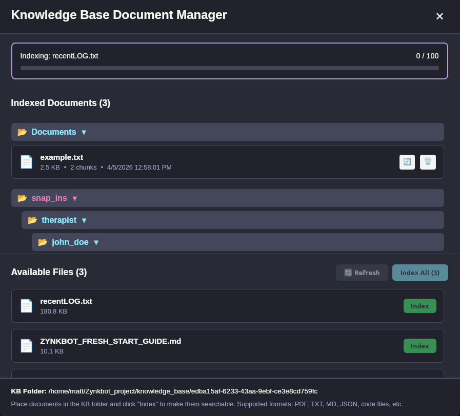
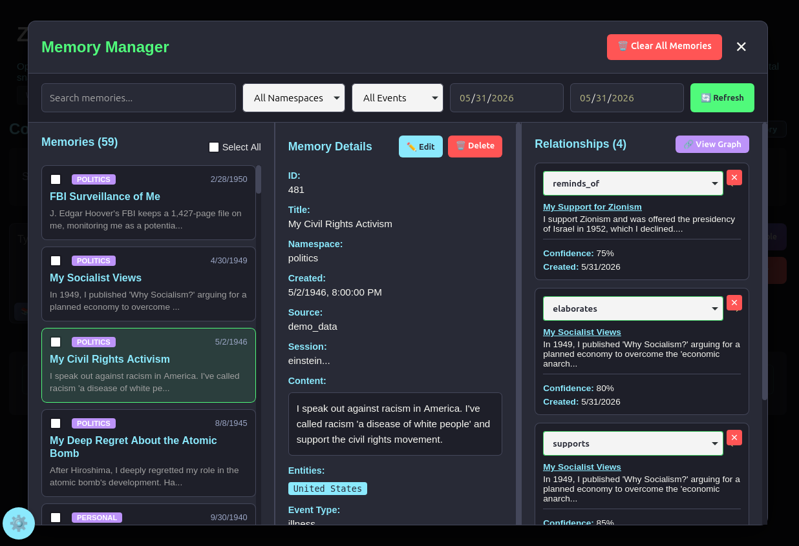
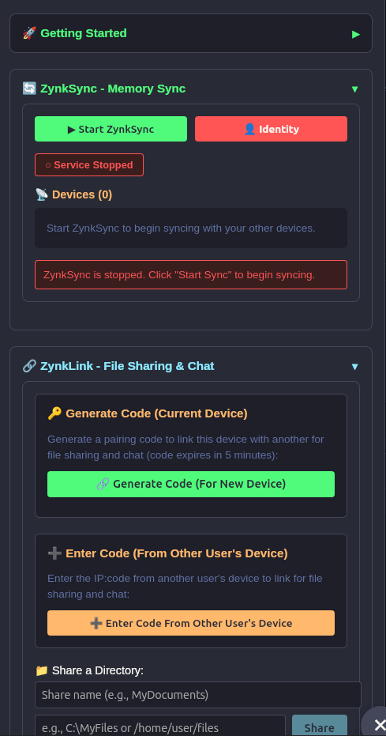

# Zynkbot Features Guide

**Comprehensive guide to all Zynkbot features and capabilities**

---

## Core Features

### 🧠 Persistent Semantic Memory

Zynkbot uses a local SQLite database for persistent, semantic memory that learns and grows over time.

**How it works:**
1. Every conversation is embedded as a 384-dimensional vector
2. Stored in a local database on your machine
3. Retrieved via semantic similarity and entities when relevant
4. Transparent recall: see exactly which memories influenced each response

**Memory Types:**
- **User Memories**: Your personal conversations and preferences
- **Foundational Memories**: System-level knowledge about Zynkbot (searched only when your query mentions "Zynkbot")
- **Knowledge Base**: Documents you import (text files, markdown, JSON, code, PDF) for RAG retrieval — stored separately from personal memories.

**Features:**
- ✅ Remembers context across sessions
- ✅ Learns your preferences over time
- ✅ Editable/deletable memories
- ✅ Foundational knowledge seeding
- ✅ No cloud dependency
- ✅ Verifiable recall (UI shows exactly which memories influenced each response)
- ✅ Search by content or namespace

**Memory stays local**

---

### 📂 Namespace Categories

Every memory is assigned a **namespace** — a category label auto-detected from the memory's
content, used to organize and filter memories in the Memory Manager.

**Canonical namespaces:**
`personal`, `work`, `career`, `health`, `family`, `education`, `technology`, `science`,
`philosophy`, `politics`, `travel`, `achievements`, `biography`

**UI features:**
- Namespace filter dropdown in Memory Manager
- Namespace selector when editing memories

**Note:** Namespaces are category labels, not folder hierarchies. You cannot create custom
namespace trees in the current UI — memories are categorized into the canonical list above.

**Planned:** Custom namespaces (user-defined categories) and custom modes (user-defined containment modes) are on the development roadmap.

---

### 🔒 Containment Modes

Multiple safety modes with category-based filtering.

| Mode | Safety Level | Use Case | Blocked Categories |
|------|-------------|----------|-------------------|
| **Guardian** | Moderate (default) | General use, blocks severe harm | Violence, sexual, self-harm, weapons |
| **Child** | Strict | For minors, blocks all unsafe content | All unsafe categories |
| **Sovereign** | Warnings only | Warns but doesn't block | None (warnings only) |
| **Witness** | No filtering | Full freedom, no restrictions | None |
| **HIPAA** | Healthcare compliance | PHI protection, blocks medical advice | Custom PHI + medical content rules |

**Safety Implementation:**

**Desktop/Laptop:**
- Uses **TinyBERT (toxic-bert)** (~500MB model) for local, offline content filtering
- Detects: violent crimes, self-harm, sexual content, child exploitation, dangerous advice, hate speech
- Runs locally, fast enough to not be perceptible to users in normal conversation
- 100% private - no data leaves your device

**Child Mode:**
- Uses **OpenAI Moderation API** for strict filtering.  Currently available models that run locally can be tricked by a clever child, so an API call to OpenAI is used because child safety is at issue.  If local distributed AI inferences are possible local models may become sufficient.  Currently - requires OpenAI API key.

**HIPAA Mode:**
- **7 PHI detection patterns**: SSN, phone, email, ZIP, credit card, IP, address
- **Pre-LLM blocking**: PHI blocked BEFORE AI sees it
- **Audit logging**: Daily JSON logs in `logs/hipaa_audit/`
- **Memory extraction disabled**: Personal memory system fully disabled in HIPAA mode — extraction pipeline does not run
- **Medical disclaimers**: Auto-appended to health-related responses

**HIPAA is one example.** The containment architecture is designed to be extended to other regulated industries — legal (attorney-client privilege), financial services, mental health records, and others. HIPAA is the first fully-specified implementation. See the [HIPAA Security Integration Guide](architecture_and_development/HIPAA_SECURITY_INTEGRATION_GUIDE.md) for deployment detail, use case scenarios, and compliance context.

---

### 🖥️ LLM Backend Configuration

Zynkbot supports multiple LLM backends with mid-conversation switching via the UI.


#### Option 1: Local Inference (Default, Privacy-First)

**How it works:**
- Place `.gguf` model files in `zynkbot_rust/src-tauri/models/user/` directory
- Models are auto-discovered and appear in Settings panel
- No API key needed - runs completely offline

**Recommended models:**
- **Llama 3.2 3B Instruct** (2.0GB) - Fast, balanced performance
- **Qwen 2.5 7B Instruct** (4.4GB) - Best coding and reasoning
- **Dolphin Mistral 7B** (4.1GB) - Uncensored, creative responses

**Download:**
- `install.bat` offers to download automatically during installation
- Or download manually from [Hugging Face](https://huggingface.co/models?library=gguf)

**Performance:**
- CPU: Works, but slower (15-90s responses)
- GPU (CUDA): 2-30s responses (hardware dependent) 
- Quantized models (Q4_K_M) recommended for best speed/quality balance

#### Option 2: OpenAI API

**Configure in Settings:**
- Click Settings (gear icon) → API Keys
- Add your OpenAI API key: `sk-...`

**Features:**
- High-quality reasoning
- Wide model availability

#### Option 3: Anthropic API (Claude)

**Configure in Settings:**
- Click Settings → API Keys
- Add Anthropic API key: `sk-ant-...`

**Features:**
- Excellent reasoning and code generation
- Large context windows

#### Option 4: xAI API (Grok)

**Configure in Settings:**
- Click Settings → API Keys
- Add xAI API key

**Model Switching:**
- Switch between any configured backend via dropdown in chat UI
- Switch mid-conversation without losing context
- Memories persist across all backends
- API backends send prompts to third parties (memory stays local)

**Note on API providers:** The three cloud API providers (OpenAI, Anthropic, xAI/Grok) are currently hard-coded. Adding additional providers (Gemini, Mistral API, etc.) is straightforward — each requires a small adapter implementing the shared LLM trait.

---

### 💬 Conversation History

Every completed exchange is automatically saved to a local database. Conversation history is the raw message log — distinct from the memory system (which stores extracted facts).

**Features:**
- Sessions grouped by date (Today / Yesterday / This Week / Month)
- Full-text search across all past conversations
- Date range filter to narrow results
- View complete message history for any session
- **Resume** — reload a past session into the active chat, restoring full conversation context
- Delete individual sessions

**HIPAA mode:** Conversation history is completely disabled. No records are written — raw conversation text is more sensitive than extracted facts, and disabling both is the correct default.

**Access:** Click the **History** button in the Conversation pane header (top of the chat area)

> **MemoryVault (v2.0+):** The conversation history tables include hash chain columns (`entry_hash`, `prev_hash`) reserved for MemoryVault — a tamper-evident layer that cryptographically verifies no records have been altered. Basic conversation history is v1.0; hash-chain integrity verification is v2.0.

---

### 📚 Knowledge Base



Upload documents and search them semantically during conversations.

**Supported formats:**
- Text files (.txt, .md)
- JSON files (.json)
- Code files (any language)
- PDF documents

**How it works:**
1. Index files via Settings → Knowledge Base
2. Documents chunked and embedded as vectors using hybrid search (semantic + keyword)
3. Click the 📚 **KB button** in the message input window to search your documents for one message; click again to lock it on across all messages (📚 **KB LOCK**); click once more to turn off
4. Relevant chunks retrieved and included in conversation context

**Features:**
- ✅ Semantic search (not just keyword matching)
- ✅ Context-aware retrieval
- ✅ Upload multiple documents
- ✅ Manage documents via UI

**Use cases:**
- Personal documentation (recipes, notes, procedures)
- Work documentation (company policies, technical specs)
- Research papers and articles
- Code repositories

---

### 🎛️ Memory Manager



Professional database-style interface for managing your memories.

**Features:**
- **Search/Filter**: Find memories by content, tags, or namespace
- **Inline Editing**: Edit memories directly in the UI
- **Bulk Operations**: Delete multiple memories at once
- **Database-style UI**: No SQL knowledge required

**Access:**
- Click 🧠 **Memory Manager** button in header
- Opens dedicated memory management interface

**Operations:**
- View all memories in database-style table
- Filter by namespace (personal, work, family, etc.)
- Edit memory content and metadata
- Delete unwanted memories
- See memory relationships (contradicts, supports, etc.) — see [Memory Relationship Graph](architecture_and_development/MEMORY_RELATIONSHIP_GRAPH.md) for a full explanation of the graph, its practical uses, and its research potential

---

### 🧩 Foundational Memories (System Knowledge)

Foundational memories are system-level entries stored with `user_id='system'` and `namespace='_zynkbot'`. They contain Zynkbot's built-in self-knowledge — what it is, how it works, its design principles, and any domain-specific knowledge configured for your deployment.

**How they work:**
- Automatically excluded from the Memory Manager UI (to keep your personal memories view clean)
- Automatically included in semantic search during conversations alongside your personal memories when you mention "Zynkbot"
- Stored in the same local database as your memories, filtered out of the user-facing view

**Viewing system memories (direct database access):**

```bash
# Linux
sqlite3 ~/.local/share/zynkbot/zynkbot.db

# Windows — open a terminal and run:
# sqlite3 %LOCALAPPDATA%\zynkbot\zynkbot.db
```

```sql
-- View all system memories
SELECT id, title, SUBSTR(content, 1, 100) as preview, created_at
FROM memories
WHERE user_id = 'system' AND namespace = '_zynkbot'
ORDER BY created_at DESC;
```

**Editing system memories:**

```sql
-- Update a system memory's content
UPDATE memories
SET content = 'Updated content here'
WHERE id = '<memory_id>' AND user_id = 'system';

-- Delete a specific system memory
DELETE FROM memories
WHERE id = '<memory_id>' AND user_id = 'system';
```

**Backing up system memories before bulk changes:**

```bash
# Simplest: copy the database file
cp ~/.local/share/zynkbot/zynkbot.db ~/zynkbot_backup_$(date +%Y%m%d).db

# Or export just the memories table
sqlite3 ~/.local/share/zynkbot/zynkbot.db ".dump memories" > memories_backup.sql
```

**Adding domain-specific system memories (specialized deployments):**

For medical clinics, legal offices, schools, or other specialized use cases, you can add custom system memories that will be retrieved during relevant conversations:

```sql
INSERT INTO memories (user_id, title, content, namespace, source_type, session_id)
VALUES ('system', 'Custom Domain Knowledge', 'Your content here...', '_zynkbot', 'manual', 'seed');
```

Note: This inserts the text record. To make the memory semantically searchable, embeddings need to be generated — re-running the seeding process or restarting Zynkbot will trigger embedding generation for any entries missing vectors.

**Use cases:**
- Customize Zynkbot's self-description for your specific deployment (e.g., an org-specific install - rebranding is allowed as long as a licenses are purchased for commercial uses,"Your Ethical AI" instead of "Zynkbot")
- Add domain knowledge (medical protocols, legal guidelines, educational materials) that surfaces during conversations
- Update or remove entries as your use case evolves

**Best practices:**
- Keep entries concise (1–3 paragraphs each)
- Use clear, searchable titles
- Do not store API keys or credentials — use `.env` for secrets
- Back up before bulk deletions

---

### 🔗 Networking Features



See [NETWORKING_FEATURES.md](NETWORKING_FEATURES.md) for detailed documentation:

- **ZynkSync** - Memory synchronization across your devices
- **ZynkLink** - File sharing between paired devices
- **ZChat** - Device-to-device messaging

---

### 🤝 Ensemble Mode

Query multiple AI models simultaneously and synthesize their responses into a consensus answer. Works with any combination of local and API models — no network required.

**Best for:** fact-checking, catching hallucinations, contested questions, and any decision where you want more than one AI perspective before acting.

See [ENSEMBLE_MODE.md](ENSEMBLE_MODE.md) for full documentation.

---

### 📎 Image Attachments (Vision)

Attach images to any message when using a vision-capable cloud model.

**Supported formats:** JPG, JPEG, PNG, GIF, WebP, BMP

**Supported models:** Anthropic Claude, OpenAI GPT-4o, xAI Grok. Local GGUF models do not support vision.

**How to use:**
1. Click the 📎 attach button in the chat input
2. Select an image file
3. A thumbnail preview appears — type your question and send

---

## Advanced Features

### Hybrid Memory Search

Zynkbot uses parallel entity-based + semantic search for optimal memory retrieval.

**Two-pronged approach:**

1. **Entity-based search** (BERT NER)
   - Extracts named entities from your query (people, places, topics)
   - Searches for exact entity matches in memory database
   - Fast and precise for specific facts

2. **Semantic search** (embeddings)
   - Converts query to 384-dim vector
   - Finds semantically similar memories via cosine similarity
   - Great for conceptual questions

**Execution:**
- Entity extraction runs first (BERT NER), then embedding generation
- Results combined and ranked by weighted score: entity overlap 60%, semantic similarity 40%
- Best of both worlds: precision + semantic understanding

---

### Fact Extraction

Automatically extracts personal facts from conversations for memory storage.

**Extraction pipeline:**
1. Conversation analyzed after each exchange
2. Personal facts identified using LLM-based extraction
3. Each fact stored with:
   - Content (third-person): "User studied abroad in Tokyo in 2019"
   - First-person form: "I studied abroad in Tokyo in 2019"
   - Title: "Studied abroad in Tokyo"
   - Namespace: personal, work, travel, etc.
   - Tags: ["travel", "japan", "education"]
   - Confidence: 0.0-1.0

**Extraction rules:**
- Only extracts facts stated BY THE USER
- Focuses on facts that are personal to the user
- Each fact is a complete, standalone statement
- Questions are processed — personal facts embedded in questions are extracted (e.g., "my sister in Portland" from "What should I get my sister in Portland?")
- Each message is split into clauses at contrasting conjunctions (but, however) and each clause is checked independently
- Empty array if no personal facts present

---

### Contradiction Detection


Automatically detects when new information contradicts existing memories.

**How it works:**
1. New memory compared against existing memories semantically
2. If high similarity but conflicting content detected
3. **Contradiction Resolution Modal** appears
4. User chooses:
   - Keep old memory (discard new)
   - Keep new memory (discard old)
   - Not a contradiction (both are true and unrelated — removes the contradiction edge)
   - Accept the contradiction (keeps both with the contradiction edge intact)
   - Resolve with explanation (stores an explanation memory linked to both via `resolves` edges)

---

### Entity Extraction

Named Entity Recognition (NER) using BERT for enhanced memory search.

**Extracts:**
- People names
- Organizations
- Locations
- Products/Technologies
- Dates and times

**Use cases:**
- "What did I say about Tesla?" - finds all Tesla-related memories
- "Who is John?" - retrieves all memories mentioning John
- Enhanced search precision for proper nouns

---

### Ephemeral Mode

Ephemeral mode allows a session to proceed without writing anything to the memory database — conversations feel normal but nothing is stored. An 8-hour expiration timestamp is applied to any memories that persist, as a defense-in-depth fallback.

**Current status:**
In HIPAA mode, the memory extraction pipeline is now fully disabled — extraction doesn't run at all, making the 8-hour expiration a safety net rather than the primary protection. Ephemeral mode as an active feature is not currently used elsewhere in the application. It remains in the codebase as a foundation for future use cases where session-scoped memory control is needed without a full containment mode change.

**Where this becomes useful:**
- **Guest / kiosk mode** — a shared device where each user gets full AI capability for their session but nothing should persist to the next user
- **Shift-based professional contexts** — clinical or service environments where per-shift memory clearing matches operational workflow
- **User-controlled sensitive sessions** — a planned toggle (not yet implemented) allowing any user to mark a single session as ephemeral without switching containment modes

**Note — conversation history vs. memory:** Ephemeral mode disables *memory storage* (extracted facts written to the database). It does not affect conversation history, which is a separate system. As of v1.0, Zynkbot has persistent conversation history (raw message log, searchable, resumable). **MemoryVault** (v2.0+) will add tamper-evident hash-chaining on top of the existing conversation history tables.

**Planned:** A manual ephemeral toggle accessible from session controls, allowing any user to disable memory storage for a single conversation without switching containment modes.

---

## Platform Features

### Pure Rust ML Stack

Zynkbot uses Candle framework for all machine learning:

- ✅ **No Python runtime** - Pure Rust, no Python dependency at any stage
- ✅ **Fast startup** - 2-3 seconds on modern hardware
- ✅ **Cross-platform** - Windows, Linux, macOS (untested), iOS/Android (planned)

**ML stack:** Embeddings, safety classification, and NER all use Candle — pure Rust, no C++. Local GGUF chat model inference uses llama-cpp-2, which compiles C++ at build time. End users installing a pre-built binary need neither Python nor a C++ compiler.

**System models (auto-downloaded):**
- `all-MiniLM-L6-v2` - Embeddings (384-dim vectors)
- `toxic-bert` - Safety classifier
- `bert-base-NER` - Entity extraction

**Note on BERT NER:** Running `bert-base-NER` required implementing `BertForTokenClassification` in the Candle ML framework, which did not previously support it. This was contributed back to the Candle project: [candle#3212](https://github.com/huggingface/candle/pull/3212/changes/1dd2d2c70a41d2969f13d5aa5c512251dc353773).

---

### Tauri Desktop Application

Native desktop application with OS integration:

- ✅ **Not a web browser** - True native app
- ✅ **Native window** - OS-native chrome
- ✅ **File system access** - Direct file operations
- ✅ **Fast** - Rust backend, React frontend

---

### Privacy-First Architecture

**Core principles:**

1. **Local-first**: All data stays on your device by default
2. **No telemetry**: Zero tracking or data harvesting
3. **Transparent**: See exactly what AI remembers
4. **User control**: Edit, delete, export all data
5. **Optional APIs**: Cloud LLMs are opt-in, not required

**Data flows:**
- Memories: Local database (never sent to cloud)
- Embeddings: Generated locally (Candle framework)
- API calls: Only when YOU choose API models
- Safety filtering: Local TinyBERT (no cloud)

**What leaves your device (only if YOU enable):**
- Conversation prompts (if using API models like GPT-4, Claude)
- Web searches (if using web search)
- Voice dictation audio (if using Web Speech API - optional)

**What NEVER leaves your device:**
- Memory database
- Embeddings vectors
- Knowledge base documents
- ZynkSync/ZynkLink/ZChat traffic (local network only)

---

## License

Zynkbot is dual-licensed:
- **AGPL v3** - Free for non-commercial use
- **Commercial License** - Required for commercial use (contact: matt@containai.ai)

See [LICENSE](../LICENSE) for full terms.
