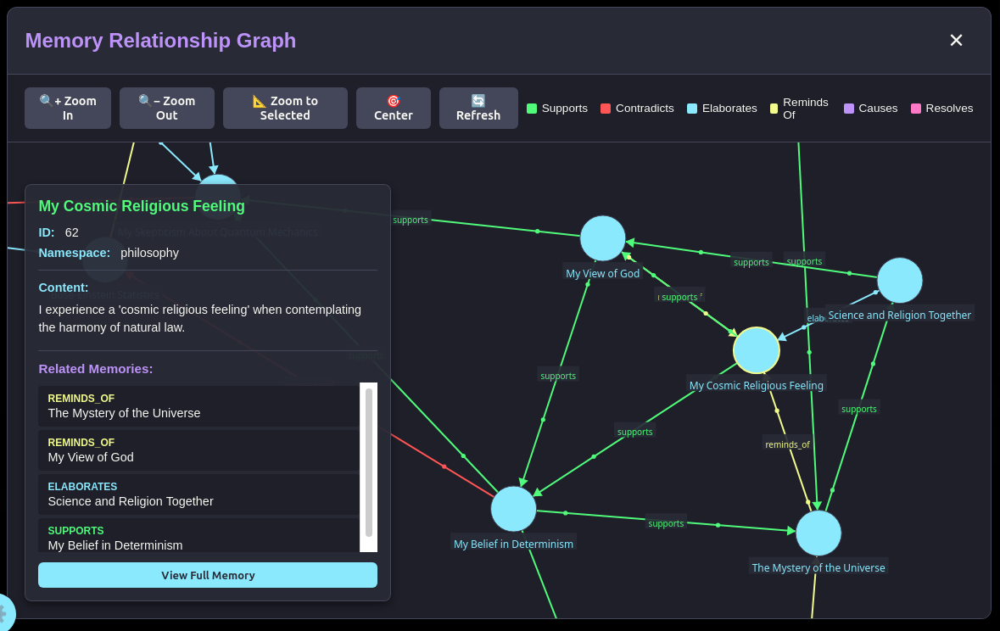

# Memory Relationship Graph

The Memory Relationship Graph is one of Zynkbot's most distinctive features. It visualizes not just what you know, but how you think — the connections, tensions, and causal chains between everything you have shared with your companion.

This document covers what the graph is, what it is useful for today, and what could theoretically be done with this kind of data in the future — with your full knowledge and consent.

---

## What the Graph Represents

Each **node** is a stored memory: a fact, belief, experience, or statement you have shared with Zynkbot.

Each **edge** is a relationship the system detected between two memories, classified into one of five active types:

| Relationship | Meaning |
|---|---|
| `supports` | Memory A provides evidence for or reinforces Memory B |
| `contradicts` | Memory A conflicts with Memory B (you are notified when this happens) |
| `elaborates` | Memory A adds detail or context to Memory B |
| `caused_by` | Memory A was caused by or follows from Memory B |
| `reminds_of` | Memory A is associatively connected to Memory B without strict logical dependency |

`quotes` is registered in the database but not currently generated by the pipeline (reserved for a future citation or reference snap-in). `resolves` is actively used: when a user selects "Resolve with explanation" during conflict resolution, the explanation is stored as a new memory and linked to both conflicting memories via `resolves` edges. One-hop graph traversal surfaces this explanation on future recall of either conflicting memory.

  

Relationships carry a **confidence score** (0.0–1.0) set at detection time. The graph is built incrementally — every time you have a conversation that produces a stored memory, the system runs a hybrid search to find the most semantically similar existing memories and classifies the relationship between them using the LLM.

---

## What Your Graph Tells You Right Now

### Contradiction Detection
When something you say conflicts with something you said before, Zynkbot flags it in real time and presents five resolution options: keep the older memory, keep the newer memory, mark them as not actually contradictory (removes the edge), accept the contradiction (keeps both with the edge intact), or resolve with an explanation (stores your explanation as a new memory linked to both via `resolves` edges). This is the most immediately practical use of the graph: keeping your companion's understanding of you accurate.

### Central Beliefs
In any force-directed graph layout, highly connected nodes gravitate toward the center. The nodes at the center of your graph are the concepts, beliefs, or experiences that most of your other memories connect to — your intellectual and personal anchors.

### Isolated Knowledge
Nodes on the periphery with few or no connections represent things you mentioned once or areas where your thinking is less developed. These gaps can also be potentially informative.

### Cluster Structure
Groups of tightly connected nodes reveal how you mentally organize a domain. Your nodes about work might form one tight cluster, health another, with only a few bridge nodes connecting them. Those bridge nodes — the memories that link otherwise separate areas - contain potentially important data about you.  Sometimes a connection between memories can surface which you may never have considered.

### Causal Chains
Following `caused_by` edges traces your own narrative of why things happened. This is your personal causal model of your life, not an externally assigned one.

---

## Your Data Is Yours

**Every memory, every relationship, and every embedding is stored locally on your device.** Nothing in your graph is uploaded, shared, or accessible to anyone without your explicit action. Zynkbot does not have a telemetry server. There is no cloud sync unless you build one yourself.

This is not a privacy policy. It is an architectural guarantee: the database lives on your machine, and the application has no mechanism to send it anywhere.

This means your graph data is genuinely valuable — and it belongs entirely to you. You can export it, analyze it, delete it, or do nothing with it. That choice is yours alone. 

ContainAI is planning an opt-in zero-trust server for your Zynkbot's memory vault, to backup your Zynkbot or install your bot anywhere without Zynksync.

---

## Theoretical Research Value

> **The following section describes potential research applications that do not currently exist in Zynkbot.** They are included here to illustrate the kind of data your graph represents and why it is worth protecting. Any future research program would require explicit, informed, revocable consent from participants.  Corporations are currently attempting to build this graph about you without your consent essentially - a user profile - and forcing an unreadable EULA on people to use unavoidable companies, such as Google or Meta, doesn't fit the definition of consent.  

The memory relationship graph is a different kind of dataset from anything that currently exists at scale. Most knowledge graphs are built from documents, databases, or structured input. This one is built from natural language conversation, which means it captures things those sources cannot:

**Belief revision over time.** Psychologists studying how people update their beliefs — in response to new information, life events, or persuasion — currently rely on carefully designed longitudinal surveys. A memory graph captures this naturally. Every `contradicts` edge followed by a `resolves` edge is potentially a timestamped record of a belief change.

**Personal causal narrative.** The `caused_by` chains in your graph reflect how *you* connect events and consequences in your own life — your internal explanatory model, not an externally assigned one. This kind of first-person causal structure is extremely difficult to capture.

**Knowledge topology.** The structure of your graph — which concepts are central, which are isolated, how clusters form and connect — is a map of how you organize a domain mentally. Two experts in the same field may have very different graph topologies. Two people who received the same education but arrived at different conclusions may show it structurally.

**Implicit knowledge.** Surveys capture what people say they know. Conversation captures what they actually assume. The difference is significant and difficult to study at scale.

**Labeled relationship data.** The `supports / contradicts / elaborates / caused_by` labels applied by the LLM to real human statements are exactly the kind of annotated data that natural language processing research requires for training relationship extraction models — and it is expensive and less natural to produce through human annotation alone.

Mental health experts might have many more ideas which would never occur to me.

---

## Volunteer Research Participation (Theoretical)

A future Zynkbot research program could allow users to voluntarily contribute anonymized graph data to research. This would be strictly opt-in, revocable at any time, limited to specific research questions the user agrees to, and governed by the same data sovereignty principles that govern the rest of the application.

Some research directions that would be genuinely novel with this kind of dataset:

- **Belief revision patterns** across different demographics or cultural backgrounds
- **Misinformation markers** — does the graph topology of someone who holds a false belief look structurally different from someone who holds a true one?
- **Expertise structure** — how does a domain expert's knowledge graph differ from a novice's in the same domain?
- **Cognitive resilience** — do people with more densely connected, well-resolved graphs report better mental clarity or decision-making outcomes?
- **Opinion evolution** — how do major life events, reading, or conversations shift the topology of someone's graph over months or years?

None of this requires surveillance. It requires volunteers who understand the value of what they hold and choose to share it on their own terms.

---

## Snap-In Concepts

The graph data enables snap-ins that go well beyond what a conventional AI assistant can offer. The following are conceptual examples of what could be built using the graph structure.

### Belief Consistency Auditor
Periodically analyzes your graph for unresolved contradictions by life domain and surfaces a simple consistency report: *"In the last 30 days you have updated 3 beliefs about your health habits. Two remain unresolved."* Useful for anyone trying to maintain a coherent self-model — therapists, coaches, people engaged in deliberate self-improvement work.

### Symptom Pattern Tracker
Searches your memory history for recurring health mentions — pain, fatigue, headaches, digestive issues — and looks for co-occurring entries to surface correlations. *"You've mentioned headaches 9 times over the past 6 weeks, most often in entries that follow poor sleep or high-stress workdays."* Useful before a doctor's visit, or simply for noticing what you'd otherwise miss across months of scattered notes.

### Cognitive Shift Journal
Traces how your beliefs have changed over time by following `contradicts → resolves` chains. Produces a readable timeline: *"Six months ago you believed X. After [event], you updated to Y, then refined that to Z."* This is your intellectual autobiography, assembled automatically from the record you created without knowing you were creating it.

### Fitness Consistency Monitor
Tracks stated workout goals against reported activity over time. Notices when you have gone off plan, how long gaps typically last, and whether you tend to restart after specific kinds of events. Does not require a formal log — it works from whatever you mention naturally in conversation. *"You have noted three separate restarts of your running routine this year, each following a gap of about two to three weeks."*

### Causal Chain Explorer
Extracts and visualizes the `caused_by` chains in your graph, grouping them by domain. Shows you the causal narratives you have constructed about your own life: why you ended up in your career, why a relationship changed, what sequence of events led to a current situation. Useful for therapy contexts, life review, or simply understanding your own explanatory patterns.

### Sleep Quality Correlator
Searches `caused_by` and `reminds_of` chains around sleep-related memories to surface what else tends to appear on nights you reported sleeping poorly — late work sessions, alcohol mentions, anxiety entries, exercise gaps. Produces a personal correlation list rather than generic advice. What disrupts your sleep is specific to you; this finds the pattern in your own record.

### Knowledge Gap Detector
Identifies nodes in your graph with unusually few connections or very low confidence scores and surfaces them as areas worth exploring. *"You have mentioned financial planning 14 times but it connects to almost nothing else in your graph — it appears to exist in isolation from your other goals."* Useful for learning programs, personal development, or spotting blind spots.

### Values-Behavior Consistency Tracker
Surfaces `contradicts` edges specifically between memories that state a value or intention and memories that describe actual behavior. *"In March you noted that work-life balance was a priority. Since then your entries include 11 references to working late or weekend sessions."* Not a judgment — a mirror. The gap between what we say we care about and how we actually spend our time is one of the most useful things to see clearly, and one of the hardest to see without a record.

---

## Technical Reference

For developers and researchers working with graph data directly:

**Node schema** (the `memories` table):
- `id` — integer primary key
- `title` — LLM-generated summary title
- `content` — processed memory text
- `embedding` — 384-dimensional vector (all-MiniLM-L6-v2)
- `entities_detected` — JSONB array of named entities (PER/LOC/ORG/MISC with confidence)
- `namespace` — categorical domain label
- `created_at` — timestamp

**Edge schema** (the `memory_links` table):
- `source_memory_id`, `target_memory_id` — foreign keys to memories
- `relation_type` — one of the relationship types listed above (`supports`, `contradicts`, `elaborates`, `caused_by`, `reminds_of`, plus reserved types `quotes` and `resolves`)
- `confidence` — float 0.0–1.0
- `notes` — optional free-text annotation
- `created_by` — who/what created this edge (`system`, `einstein-seed`, or a user identifier)

**Graph format for export:** The graph is representable as a standard directed property graph. Export to GraphML, JSON-LD, or Cypher (Neo4j) format is a natural target for a future snap-in or CLI tool.

**Relationship detection pipeline:** See [Memory Processing Pipeline](MEMORY_PROCESSING_PIPELINE.md) for how relationships are detected — the hybrid search that produces candidates and the LLM classification pass that assigns relationship types and confidence scores.

---

*The memory relationship graph is an early-stage implementation. Relationship detection accuracy, graph export tooling, and research participation infrastructure are all areas of active development. See [ROADMAP.md](../ROADMAP.md) for planned improvements.*
