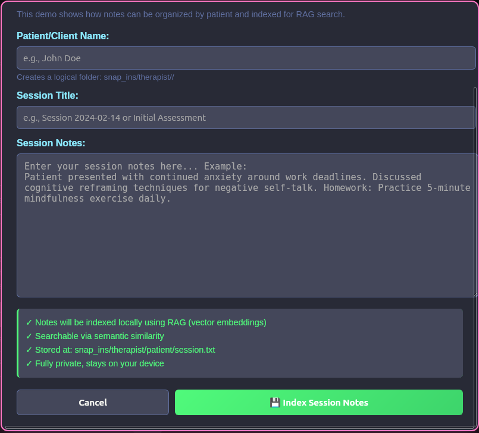

# Professional Snap-ins Overview

Snap-ins are domain-specific apps that extend Zynkbot into any context where accumulated knowledge and personal context make an AI genuinely useful. That's almost everywhere.

A therapist finding patterns across six months of patient notes. A retail clerk with instant answers about store policies and procedures. A mechanic recalling equipment history across job sites. A coach logging player performance across a season. A programmer who wants to plug his personal AI companion into his project at work, so it can make code changes to a project he had been discussing with his Zynkbot at home. The common thread is that context and information accumulates, whether for work or personally, and being able to query it matters.

The existing code already handles: namespaced local storage, semantic search, persistent memory, and containment modes for sensitive use cases. What's needed is developers who understand their domain and want to build something useful for it. If Zynkbot gains a sufficient user base, there will be a market for developers who can build an ethical AI tool on the Zynkbot platform for any industry where people are using their AI companions at work, and then start a business around that app. If you can imagine a version of Zynkbot trained on your world, there is likely a snap-in worth building — and this is an open invitation to build it, and potentially monetize your industry-specific AI plugin.

One reference implementation exists: the Therapist Journal, a proof-of-concept built directly into the app. The full snap-in SDK and plugin architecture are in development — see [SNAPIN_ARCHITECTURE.md](./SNAPIN_ARCHITECTURE.md) for the technical roadmap.

---

## Snap-in Categories

### I. Healthcare & Clinical

Healthcare is one of the most compelling targets for snap-ins. The data is sensitive, the tools are often inadequate, and the offline-first architecture removes the risk of third-party exposure entirely.

* **Patient Session Notes** *(proof of concept)* — The first reference snap-in, built for solo practitioners and therapists. Each patient has their own namespace in the knowledge base. Session notes are written after each appointment, indexed locally with vector embeddings, and become permanently searchable.

  The practical result: instead of hunting back through months of handwritten notes or scrolling a long document, a therapist can ask *"What has this patient said about their relationship with their father?"* or *"When did sleep problems first come up?"* or *"What patterns appear across this patient's last twelve sessions?"* The AI finds it. The notes never leave the device.

  Designed for solo practitioners. Explicitly non-diagnostic.

  

  
<em>Session notes are indexed locally for semantic search — stored at snap_ins/therapist/patient/session.txt, fully private, never leaving the device.</em>

* **Some other potential use cases (just a few possibilities):**

* **Shift Scope Assistant** — Temporary memory layer for shift-specific protocols and tasks. Scoped to the active shift and cleared on handoff.

* **Medication Crosscheck** — Track schedules, flag allergy risks, and note interaction concerns locally. Designed for caregivers and home health aides, not clinical diagnosis.

* **Emergency Offline Deployment** — Zynkbot running as a shared local server on a LAN with no internet required. Built for rural clinics, field hospitals, or disaster response contexts where connectivity cannot be assumed.

🔗 [View use case — Emergency Resilience](../case_studies/emergency_resilience.md)

---

### II. Retail & Service

Front-line workers who need fast, reliable access to institutional knowledge without relying on cloud tools or training managers.

* **Retail Floor Assistant** — Store policies, return procedures, product knowledge, and escalation paths — searchable in plain language. A new hire can ask "what's the return policy on opened electronics?" and get an answer in seconds. The knowledge base is built from the store's own documentation.

* **Personal Trainer Client Tracker** — Log client goals, injuries, progress, and program history. Recall any client's full history before a session without searching through paper files or spreadsheets.

* **Music Teacher Studio Log** — Student repertoire, lesson notes, recital history, and parent communication logs. Useful for independent instructors managing multiple students across years.

---

### III. Skilled Trades & Field Work

Zynkbot's offline-first architecture makes it well-suited for field contexts where connectivity is unreliable and notes need to be captured quickly without a cloud intermediary.

* **Work Order Memory** — Tracks job sites, equipment, client notes, and flagged issues across visits. Recall by location, client, or equipment type.

* **Hands-Free Logging**  — Dictate documentation and notes for job sites to your bot: log incidents, tag issues, generate reports. Depends on Whisper integration, currently experimental.

* **Agricultural Field Journal** — Crop conditions, treatment history, and observations per plot or field section. Useful for small farms where institutional memory lives in one person's head.

🔗 [View use case — Field Repair Recall](../case_studies/hvac_field_service.md)

---

### IV. Sensitive Research

For any work where source confidentiality, document security, or investigative integrity is non-negotiable. Journalism is the obvious use case, but the same architecture applies to legal work, academic research involving human subjects, and investigative roles of all kinds.

* **Source Protection Companion** — Encrypted local notes, interview fragments, and movement logs — accessible offline, never synced to external servers.

* **Legal Case Notes** — Client intake notes, case history, and strategy memos stored locally. Designed for solo practitioners and legal aid organizations where cloud storage is inappropriate for client confidentiality.

* **Investigative File Companion** — Long-form research across documents, sources, and timelines. Surfaces contradictions, tracks open threads, and maintains continuity across months of work.

🔗 [View use case — Journalist Source Protection](../case_studies/journalist_source_protection.md)

---

### V. Technical & Development

* **Code Companion** — Tracks logic across refactors, surfaces file-level context, and maintains continuity across long development sessions. The knowledge base stays on the developer's machine.

  🔗 [View use case](../case_studies/developer_workflows.md)

* **Research Log** — Captures evolving hypotheses, experimental notes, and contradictory sources — searchable across a project's full history.

* **Architecture Decision Record** — Logs the "why" behind technical decisions with timestamped context. Useful for teams where institutional memory is otherwise scattered across chat threads.

---

### VI. Personal Development & Recovery

These are among the most privacy-sensitive use cases imaginable. Cloud-synced tools are a non-starter for many people in this category. Local-first is not a feature here — it's the only acceptable architecture.

* **Therapeutic Journal** — A private, searchable space for reflection, grief processing, and exercises a therapist might assign — mood tracking, CBT worksheets, gratitude logs, letters never meant to be sent. No account required. No data leaves the device.

* **Sobriety Companion** — Tracks milestones, patterns, and difficult moments across a recovery journey. Can surface past entries for reflection and identify trends over time — without cloud storage, account creation, or any third party involved.

* **Chronic Condition Tracker** — For people managing long-term health conditions who want a searchable personal history of symptoms, treatments, and outcomes — independent of any healthcare provider's system.

---

### VII. Creative Professionals

* **Creative Loop Companion** — Remembers past drafts, recurring structures, and notes on what worked and what didn't. Surfaces patterns across projects without pushing style in any direction.

* **Feedback Tracker** — "What feedback have I already received on this?" Tags and tracks notes across drafts, clients, and projects.

* **Commission & Client Log** — For freelancers and independent creatives: tracks client preferences, revision history, and project context across engagements without a CRM.  Ask your Zynkbot about a client and your history with them.

---

## 🤝 Third-Party Integration (Future)

Once the snap-in SDK is stable, the goal is to support integrations from privacy-respecting external services — tools like ProtonMail, Standard Notes, Obsidian, or Bitwarden that share Zynkbot's local-first values. These integrations are not possible yet. When the SDK is ready, contribution guidelines will be published separately.

---

## 🔐 Snap-in Development Requirements

All snap-ins must:

* Integrate with Zynkbot's **Containment Layer, Mode System, and Consent architecture**
* **Avoid** passive or background data collection
* **Operate locally** when possible, or clearly define encrypted API boundaries

Each snap-in must include:

* **Data scope documentation** (inputs/outputs)
* **Error handling behavior** (fail-safe design preferred)
* **Consent trigger map** (what actions require user approval and when)

---

## Notes for Contributors

* Snap-ins must remain mode-aware and adhere to the trust and consent architecture.
* Favor practical over idealistic — if a snap-in can't function offline or with minimal API calls, flag it explicitly.
* Link to a case study in `/docs/case_studies/` wherever one exists.
* If you're building a snap-in for your industry and don't see it listed here, open a discussion or submit a PR — this list is meant to grow.
